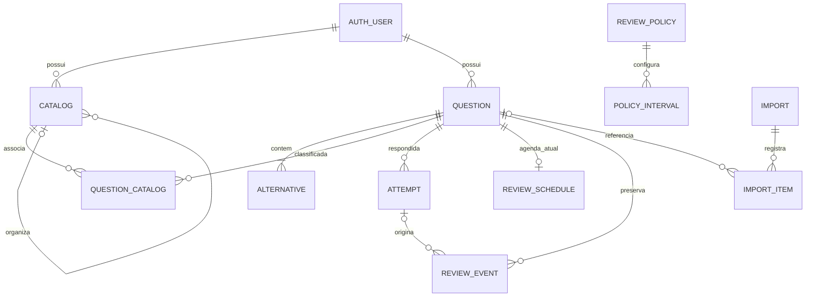

# Arquitetura e decisões

## Objetivo e limites

EstudosLP organiza o ciclo resolver → compreender → registrar → agendar → revisar → medir. O primeiro incremento entrega esse ciclo com persistência remota, e não pretende reproduzir uma plataforma comercial inteira. Decisões que alterem dados históricos, deduplicação ou autorização exigem testes de integração.

## Stack

- React + TypeScript + Vite: SPA pequena, hospedagem estática e separação clara entre interface e domínio. SSR não traz benefício relevante para um aplicativo privado de estudos.
- Supabase Auth: identidade e recuperação de acesso. Apenas URL e chave publicável no navegador.
- PostgreSQL/Supabase Data API: filtros e paginação no servidor, transações e constraints para integridade. Sem microserviços nem servidor Node permanente.
- RPCs SQL: fronteiras transacionais para resposta, agendamento, cadastro e importação. UUID da operação torna retries seguros. O banco usa o usuário autenticado, nunca um `user_id` escolhido pelo navegador.
- TipTap/ProseMirror: conteúdo rico; DOMPurify e serialização permitida protegem entrada e renderização. Texto de busca derivado do conteúdo, incluindo alternativas e explicações.
- Vitest + PGlite: testes determinísticos de domínio e execução do SQL real em PostgreSQL compilado para WASM. Testes do Supabase Auth hospedado e carga real são validações adicionais, não substituídas pelo mock do schema `auth`.

Um aplicativo com backend próprio (por exemplo Fastify) seria justificável se importações demandassem processamento longo, integração com provedores ou fila de jobs. Acrescentá-lo agora aumentaria operação e superfície de falhas. Mantemos o contrato de importação e domínio desacoplados para permitir essa evolução.

## Modelo conceitual

`Question` é conteúdo; `Attempt` registra resposta e correção naquele momento; `ReviewEvent` registra a escolha de intervalo ou ação manual; `ReviewSchedule` é a projeção atual da fila. Responder novamente não sobrescreve tentativas anteriores. Editar uma alternativa não altera o gabarito que ficou no snapshot da tentativa.

Alternativas são linhas, identificadas por chaves, com quantidade variável. Não existem colunas `alternative_a` a `alternative_e`. Classificações ficam em um catálogo tipado com associações: os tipos têm semântica fixa; os nomes cadastrados pelo usuário não são fixos. Projetos/cadernos e matérias/assuntos/subassuntos usam relações de hierarquia validadas. Questões podem pertencer a vários cadernos sem duplicação.

A questão tem uma agenda por usuário. O caderno/projeto ativo na sessão determina a política, mas não cria agendas paralelas para a mesma questão. A escolha evita que a mesma questão reapareça simultaneamente em vários cadernos. Caso agendas independentes por contexto sejam desejadas no futuro, isso deve ser uma migração explícita de produto.

## Páginas e fluxo

| Área              | Decisão que ela permite tomar                                   |
| ----------------- | --------------------------------------------------------------- |
| Entrar            | Acessar, cadastrar conta, recuperar senha                       |
| Hoje              | Ver pendências, tempo e resultado; iniciar estudo               |
| Banco de questões | Buscar texto, combinar classificações, cadastrar e editar       |
| Resolução         | Marcar resposta, conferir explicações, escolher próxima revisão |
| Revisões          | Estudar vencidas/novas, reagendar e suspender                   |
| Erros             | Revisar erros atuais, recorrentes e superados                   |
| Histórico         | Filtrar tentativas, ordenar data, consultar a questão           |
| Configurações     | Gerenciar organização, intervalos e preferências                |
| Importação        | Interpretar, mapear, validar, conferir e confirmar lote         |
| Exportação        | Baixar conteúdo, organização, configurações e histórico         |

No celular, controles têm área de toque confortável e a navegação adapta-se. O enunciado e as alternativas recebem a maior largura. A interface não deve exibir estatísticas inventadas quando o banco estiver vazio ou indisponível.

## Repetição manual

1. O servidor registra a tentativa e seu horário UTC, resultado, conteúdo e contexto.
2. A política é resolvida na ordem questão → caderno do contexto → projeto do contexto → global.
3. O usuário escolhe um intervalo ativo; o servidor confirma que pertence à política aplicável.
4. O evento copia ID, nome, valor, unidade e duração do intervalo.
5. `next_review_at = answered_at + duração_em_segundos`. Um dia representa 86.400 segundos decorridos, inclusive em transições de horário de verão.
6. Agenda atual e evento são escritos na mesma transação, com controle de versão contra concorrência.
7. A fila inclui agendas ativas com `next_review_at <= agora`.

Se o usuário fechar a tela antes de escolher o intervalo, a tentativa continua registrada e a agenda anterior permanece. Isso evita inventar uma decisão de revisão. A UI informa que o agendamento está pendente.

Alterar ou excluir um botão afeta escolhas futuras. Não recalcula agendas. Reagendamento explícito é um evento próprio, preservando a sequência anterior. Não há FSRS, SM-2, multiplicador de dificuldade nem intervalo adaptativo.

## Importação

O contrato versionado é documentado em [import-format.md](import-format.md). A prévia não grava. A confirmação passa registros validados a uma RPC que valida novamente e trata falhas por item. A identidade exata é `(usuário, origem normalizada, ID externo)`. IDs iguais em origens diferentes são permitidos.

Fingerprint de conteúdo serve apenas como aviso. Não substitui a identidade e não bloqueia uma questão semelhante. Um lote com hash/identidade de execução já concluído devolve o resultado anterior. O arquivo sem IDs não deve duplicar ao repetir a mesma importação; registros semelhantes em uma importação diferente exigem avaliação humana.

HTML de provedores não possui estrutura universal. A importação HTML aceita o formato estruturado documentado. Sites arbitrários exigiriam adaptadores específicos, fora deste incremento. XLSX é uma extensão posterior do mesmo contrato; CSV pode ser exportado de planilhas no fluxo inicial.

## Segurança

RLS em todas as tabelas expostas; leitura restrita ao dono. Mutações críticas usam funções com grants mínimos e checagem explícita de identidade. Relações entre entidades validam o mesmo proprietário. A API não confia em claims editáveis de `user_metadata`. Dados pessoais e questões não são colocados no cache do service worker.

Funções que precisam escrever no histórico protegido usam implementação interna com `search_path` fixo e autorização explícita. O histórico não recebe permissões de update/delete do cliente. Detalhes e testes estão em [database.md](database.md).

Referências: [RLS e grants](https://supabase.com/docs/guides/database/postgres/row-level-security), [autenticação por senha](https://supabase.com/docs/reference/javascript/auth-signinwithpassword), [TipTap para React](https://tiptap.dev/docs/editor/getting-started/install/react).

## Performance e evolução

- Paginação real, limitada a 100 registros por requisição; padrão de 20.
- Índices por proprietário, identidade externa, agenda ativa e data de tentativa; busca textual no PostgreSQL.
- Agregações de dashboard executadas no servidor e delimitadas por período.
- Histórico e exportação lidos em páginas; a exportação final reúne as páginas na memória do navegador. Para volumes muito grandes, evoluir para stream/job assíncrono.
- Importação síncrona tem limite de lote declarado pelo servidor. Não prometer milhares de itens ilimitados numa única transação HTTP. Jobs de staging em blocos são a próxima evolução para arquivos que excedam o limite.
- PWA para instalação e fallback de conexão. Respostas offline não são enfileiradas silenciosamente, para evitar colisões de agendamento e perda de intenção.

## Riscos a validar antes de uso contínuo

| Risco                                   | Mitigação / validação                                                                           |
| --------------------------------------- | ----------------------------------------------------------------------------------------------- |
| Concorrência entre abas ou dispositivos | Versão da agenda + UUID de operação + transação                                                 |
| Reimportação e erro parcial             | Unique constraint + log idempotente + tratamento por linha                                      |
| Vazamento entre usuários                | RLS, grants e relações com owner; testes com dois usuários                                      |
| XSS e texto não pesquisável             | Canonicalização/sanitização + extração de texto + testes adversariais                           |
| Datas diferentes em fusos               | UTC no banco, duração decorrida e exibição no fuso local                                        |
| Edição posterior de política/conteúdo   | Snapshots históricos e agenda materializada                                                     |
| Auth email e redirecionamentos          | Configuração do projeto dedicado e teste hospedado real                                         |
| 50.000 questões e histórico grande      | Ensaio de carga com dados sintéticos, EXPLAIN e medição de latência antes de afirmar capacidade |
| Custos e operação                       | Instância separada, limites do plano revisados antes de provisionar                             |

## Etapas

1. Fundação: documentação, autenticação, navegação, catálogo e modelo com isolamento.
2. Banco + estudo: cadastro rico, busca, resposta e snapshots.
3. Repetição: herança, edição de botões, fila e ações manuais.
4. Importação: contrato, parsers, prévia, deduplicação e logs.
5. Histórico + métricas: filtros e agregações úteis, exportação.
6. Qualidade operacional: teste no Supabase dedicado, fluxo ponta a ponta hospedado, responsividade, carga e recuperação de backup.

Cada etapa deve manter o mesmo núcleo confiável. O PR inicial registra exatamente o que foi executado e o que ainda precisa de ambiente hospedado. Não se considera o aceite diário concluído apenas com build local.
